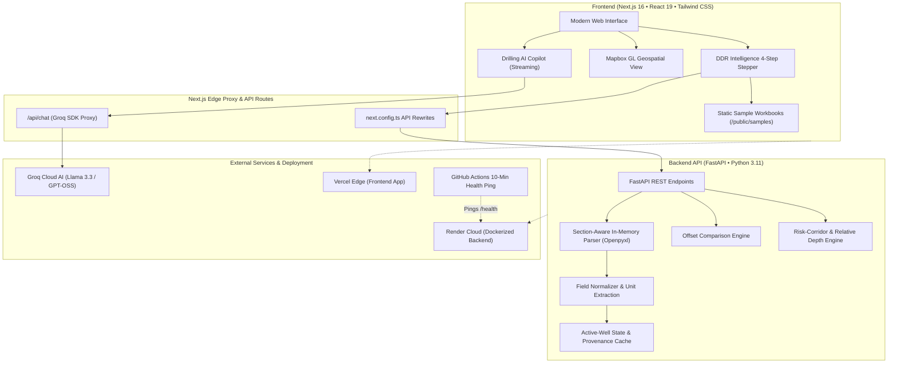

<div align="center">


[](https://fastapi.tiangolo.com/)
[](https://nextjs.org/)
[](https://react.dev/)
[](https://python.org/)
[](https://www.typescriptlang.org/)
[](https://tailwindcss.com/)
[](https://groq.com/)
[](https://www.mapbox.com/)
[](https://github.com/BuiltDifferent2026/NWIS)
[](LICENSE)

<p align="center">
  <b>NWIS (AntarRig)</b> is an intelligent, operational drilling decision-support platform designed for the <b>Oil India Limited (OIL)</b> ecosystem. It ingests complex, merged-cell Daily Drilling Reports (DDRs), updates active-well telemetry, resolves geological analogs over misleading geographic proximity, forecasts formation hazard corridors, and provides a strictly grounded AI copilot.
</p>


</div>

<div align="center">

</div>

## Overview

Daily drilling operations generate vital institutional knowledge locked inside non-flat, merged-cell spreadsheets (`.xlsx`) and fragmented field logs. **NWIS (AntarRig)** bridges the divide between real-time rig operations and historical memory by providing an auditable, section-aware ingestion pipeline and lookahead intelligence suite.

### Key Capabilities:
- **Coordinate-Aware Ingestion**: Ingests non-flat, complex Excel workbooks with merged-cell pre-indexing and two-pass alias matching without relying on fragile cloud OCR or external document parsers.
- **Active-Well State Propagation**: Seamlessly updates active well drilling parameters, depth tracking, and telemetry with full provenance metadata.
- **Geological Analog Selection**: Overcomes the dangerous **"Proximity Trap"** by proving mathematically why the geographically closest well is often geologically inferior to a more distant true analog.
- **Formation Risk Corridor**: Dynamically tracks penetration into hazardous formations (e.g. mud-loss intervals) calculated relative to formation tops rather than simple measured depth.
- **Evidence-Linked Mitigation Playbooks**: Supplies actionable step-by-step contingency playbooks directly mapped to historical Well Completion Reports (WCR) and incident archives.
- **Domain-Grounded AI Copilot**: Answers complex drilling engineering questions via streaming Groq LLM integration, strictly scoped to verified drilling parameters and best practices.

> **Core Operating Invariant:** Zero confidential data leakage. Ingestion runs safely on local compute or isolated container environments; AI operates in a strictly read-only advisory capacity.

<div align="center">

</div>

## Features

### 1. Section-Aware DDR Ingestion Engine
Standard spreadsheet parsers fail on industry DDRs due to complex merged cells, arbitrary line breaks, and multi-row header banners. AntarRig utilizes a specialized openpyxl coordinate engine:
- **Merged-Cell Pre-Indexing**: Child coordinates within any merged bounding box automatically resolve to their top-left anchor cell.
- **Two-Pass Alias Matching**: Pass 1 matches exact standardized keys; Pass 2 cleanly extracts colon-delimited or inline label-value pairs (e.g., `PRESENT DEPTH : 2,145 m`).
- **Provenance & Confidence Tiers**: Every extracted data point records its exact cell coordinate (e.g. `C12`), confidence rating (`STRUCTURED_HIGH`), and data quality tier (`HIGH`, `MEDIUM`, or `LOW`).

### 2. Multi-Factor Offset Well Comparison
Avoid the fatal drilling assumption that proximity equals similarity:
- **The Proximity Trap**: Demonstrates why **Well C** (2.1 km away) shares only a 0.61 geological match, while **Well B** (14.8 km away) is the primary analog with a **0.92 correlation** across lithology, pore-pressure profile, and casing program.
- **Multi-Factor Scoring Matrix**: Evaluates stratigraphy, structural dip, fault block alignment, pore pressure gradient, and mud weight compatibility.

### 3. Relative-Depth Formation Risk Corridor
Absolute measured depth (MD) is misleading across faulted or dipping basins:
$$\text{Relative Formation Depth} = \text{Present Depth (MD)} - \text{Formation Top (MD)}$$
- If `Present Depth = 2,145 m` and `Formation Top = 2,080 m`, penetration $\Delta = 65\text{ m}$.
- When historical loss occurs at $90\text{ m} - 140\text{ m}$, the system detects an entry distance of **$25\text{ m}$**, automatically promoting alert status from `NORMAL` to `WATCH` with real-time LCM pill pre-hydration alerts.

### 4. Interactive GIS Spatial Mapping
- Powered by high-performance **Mapbox GL**.
- Visualizes active rig coordinates, offset well clusters, hazard envelopes, and structural fault lines directly in the browser.

### 5. Grounded Drilling AI Copilot
- High-speed conversational AI powered by **Groq** (`llama-3.3-70b-versatile` / `openai/gpt-oss-20b`).
- Formatted Markdown output with syntax highlighting, drilling parameter tables, and direct contextual awareness of the active well state.
- Guardrails ensure the copilot strictly answers drilling queries and never executes unverified operational commands.

<div align="center">

</div>

## Architecture



### Directory Structure

```text
NWIS/
├── backend/                             # Python FastAPI Backend
│   ├── app/
│   │   ├── config/
│   │   │   └── ddr_template_mapping.yaml # Section boundaries & 50+ field aliases
│   │   ├── data/
│   │   │   └── mock_offset_wells.json   # Anonymized offset wells & mitigation playbooks
│   │   ├── models/
│   │   │   └── ddr_models.py            # Pydantic v2 schemas for provenance & telemetry
│   │   ├── services/
│   │   │   ├── ddr_normalizer.py        # Units, numeric casting, NPT parser
│   │   │   ├── ddr_parser.py            # Openpyxl coordinate & merged-cell resolution
│   │   │   └── ddr_validation.py        # Data quality scoring (HIGH/MEDIUM/LOW)
│   │   └── main.py                      # FastAPI app, CORS, and REST endpoints
│   ├── samples/                         # Bundled test workbooks for production Docker
│   │   ├── DDR_Template_Anonymized.xlsx
│   │   └── sample_ddr_with_mock_values.xlsx
│   ├── tests/
│   │   ├── test_api_endpoints.py        # Integration tests for FastAPI endpoints
│   │   └── test_ddr_parser.py           # Unit tests for parser, aliases, and math
│   ├── Dockerfile                       # Multi-stage production container
│   ├── requirements.txt
│   └── pytest.ini
├── nwis-app/                            # Next.js 16 (App Router) Frontend
│   ├── public/
│   │   └── samples/                     # Static test workbooks for instant CDN download
│   ├── src/
│   │   ├── app/
│   │   │   ├── ddr-intelligence/page.tsx # 4-Step Pipeline Stepper UI
│   │   │   ├── operations/              # Active Rig Workspace & Telemetry
│   │   │   ├── map/                     # Interactive Mapbox GIS View
│   │   │   ├── decay-index/             # Legacy Well Data Loss / Preservation Index
│   │   │   ├── replay/                  # Time-Series Telemetry Replay
│   │   │   └── api/chat/route.ts        # Groq streaming chatbot route
│   │   └── components/                  # Reusable UI components & layouts
│   ├── next.config.ts                   # Backend proxy rewrites & standalone output
│   └── package.json
├── samples/                             # Master repository sample spreadsheets
├── .github/workflows/
│   └── keep-render-alive.yml            # Scheduled ping to prevent free-tier spindown
├── docker-compose.yml                   # Unified container deployment
└── README.md
```

<div align="center">

</div>

## 4-Step Operational Workflow

Access the end-to-end engineering workflow via the `/ddr-intelligence` route:

| Step | Stage Name | Technical Capabilities & Engineering Safeguards |
| :---: | :--- | :--- |
| **01** | **Upload DDR** | Upload custom OIL-style `.xlsx` or load the bundled sample with 1 click. Instant local validation with zero third-party cloud data transmission. |
| **02** | **Review Extracted Data** | View normalized parameters across General Info, Operations, Mud Properties, BHA, Lithology, and NPT with cell provenance (e.g. `B14`) and confidence tags. |
| **03** | **Offset-Well Analysis** | Interactive comparison against offset wells. Identifies the primary geological analog (Well B, 0.92 similarity) vs misleading nearest well (Well C, 2.1 km). |
| **04** | **Mitigation Playbook** | 4-step actionable contingency plan (LCM pill pre-hydration, ECD cap @ 10.4 ppg, PVT alarm configuration) tied to historical incident records. |

<div align="center">

</div>

## Quickstart

### Prerequisites
- **Python 3.10+**
- **Node.js 18+** & npm
- *(Optional)* **Docker & Docker Compose**

---

### Option 1: Local Development

#### 1. Setup Backend
```bash
cd backend

# Create and activate virtual environment
python3 -m venv venv
source venv/bin/activate       # Windows: venv\Scripts\activate

# Install dependencies
pip install -r requirements.txt

# Start FastAPI server
uvicorn app.main:app --host 0.0.0.0 --port 8000 --reload
```
- API Docs: [http://localhost:8000/docs](http://localhost:8000/docs)
- Health Check: [http://localhost:8000/health](http://localhost:8000/health)

#### 2. Setup Frontend
```bash
cd nwis-app

# Install npm dependencies
npm install

# Configure environment variables
cp .env.example .env.local
```

Set the following in `nwis-app/.env.local`:
```env
NEXT_PUBLIC_MAPBOX_TOKEN=your_mapbox_token_here
GROQ_API_KEY=your_groq_api_key_here
GROQ_MODEL=openai/gpt-oss-20b
BACKEND_URL=http://127.0.0.1:8000
```

Start the Next.js development server:
```bash
npm run dev
```
Open [http://localhost:3000](http://localhost:3000) or [http://localhost:3000/ddr-intelligence](http://localhost:3000/ddr-intelligence).

---

### Option 2: Docker Compose

Launch both the frontend and backend in isolated, production-grade containers with a single command:

```bash
# Build and start services
docker-compose up --build -d

# Verify container health
docker-compose ps
```

- **Frontend App**: [http://localhost:3000](http://localhost:3000)
- **Backend API**: [http://localhost:8000](http://localhost:8000)

To stop services:
```bash
docker-compose down
```

<div align="center">

</div>


## Deployment

The architecture is split for high availability and zero cost:

| Component | Platform | Configuration |
| :--- | :--- | :--- |
| **Frontend** | **Vercel** | Set `BACKEND_URL` to your Render service URL, `GROQ_API_KEY`, and `NEXT_PUBLIC_MAPBOX_TOKEN`. |
| **Backend** | **Render** | Docker runtime (`backend/Dockerfile`). Set `ALLOWED_ORIGINS` to your Vercel frontend domain. |
| **Keep-Alive** | **GitHub Actions** | `.github/workflows/keep-render-alive.yml` automatically pings Render's `/health` endpoint every 10 minutes to prevent free-tier cold-starts. |

<div align="center">

</div>

## Security & Compliance Boundary

- **Zero Confidential Data**: All well identifiers, coordinates, formation tops, and drilling records in this repository are entirely fabricated and representative.
- **Local Compute Guarantee**: The Excel coordinate parser runs strictly in memory on local/container compute; no operational DDR is sent to external clouds or third-party OCR engines.
- **Read-Only AI Advisory**: The Groq-powered drilling copilot is strictly advisory. It cannot alter telemetry, approve operations, or dispatch drilling commands.

---

## License

This project is licensed under the [MIT License](LICENSE).

<div align="center">


</div>
